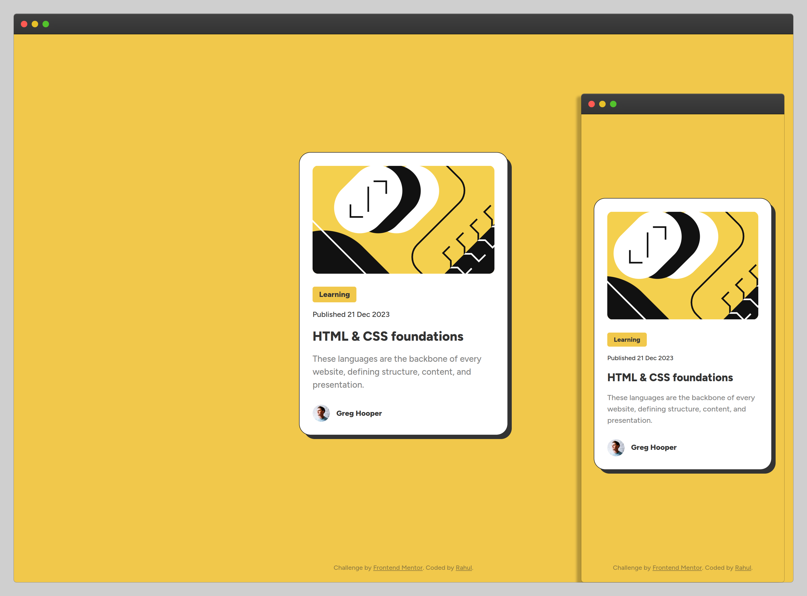

# Frontend Mentor - Blog preview card solution

This is a solution to the [Blog preview card challenge on Frontend Mentor](https://www.frontendmentor.io/challenges/blog-preview-card-ckPaj01IcS). Frontend Mentor challenges help you improve your coding skills by building realistic projects. 

## Overview

### The challenge

Users should be able to:

- See hover and focus states for all interactive elements on the page

### Screenshot

### Links

- [Solution on FrontendMentor](https://www.frontendmentor.io/solutions/blog-post-card-made-with-css-y1GKbfhyzV)
- [Live Demo on Vercel](https://blog-preview-card-ochre.vercel.app/)

## My process

### Built with

- Semantic HTML5 markup
- BEM methodology
- CSS custom properties
- CSS Grid
- CSS Flexbox
- Mobile-first workflow (Progressive enhancement)

### What I learned

I revisited the differences between the number and percentage-based CSS `line-height` values and used that knowledge to fix the micro-level spacing issues in my implementation of the designs shared in this project. Also, I've used CSS Grid and Flexbox properties in a few places such as quick card alignment inside the master container and future-proofing the tag list and meta info by adding flexbox-powered horizontal lists.

Like always, I used the variable font alternative shared in the project to avoid additional `@font-face` blocks to load differnet weights and styles.

I avoided applying Flexbox to the card for structural alignment and tried best to stick to regular flow of the blocks as no special alignment tactics were needed as such. This made the task of accurate spacing a bit complicated too, but that's how we get to learn things sometimes: line heights in this case.

_You may take a look at [the debug page](./debug.html) to observe the similarity between the final ouput and the designs._

### Useful resources

- [What's the difference between decimal and percentage line-height](https://stackoverflow.com/a/32995898/720310) - This SO answer can be helpful in knowing the rarely-discussed difference between the number and percentage-based line-heights in CSS.

## Author

- [github / c99rahul](https://github.com/c99rahul)
- [FrontendMentor / c99rahul](https://www.frontendmentor.io/profile/c99rahul)
- [Twitter / @c99rahul](https://www.twitter.com/c99rahul)